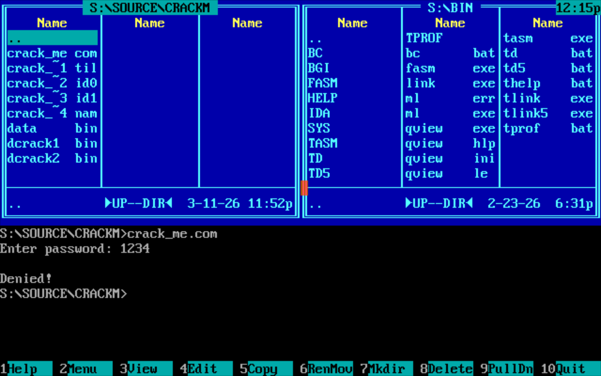
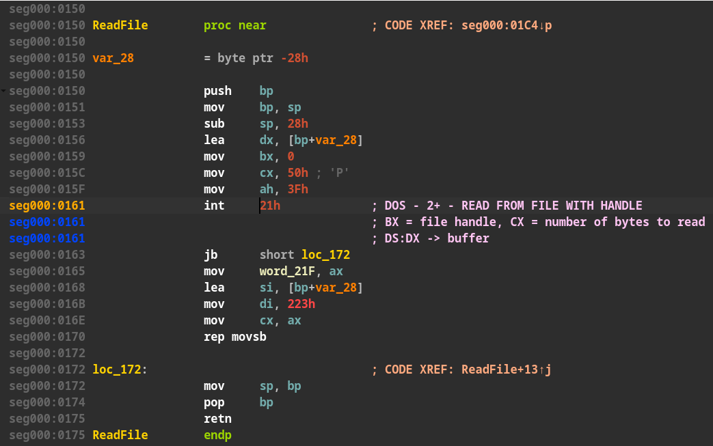
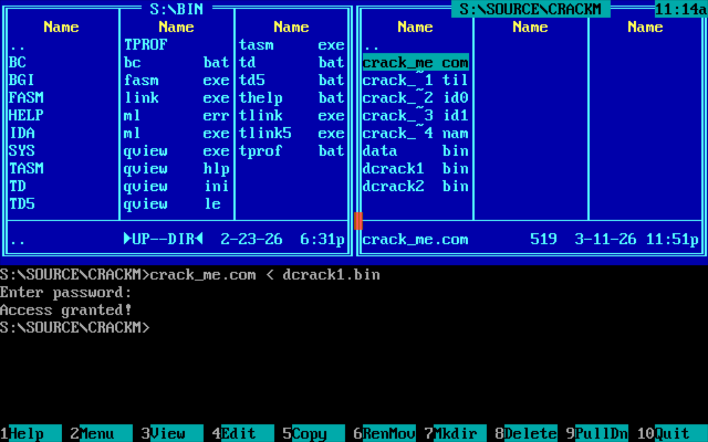
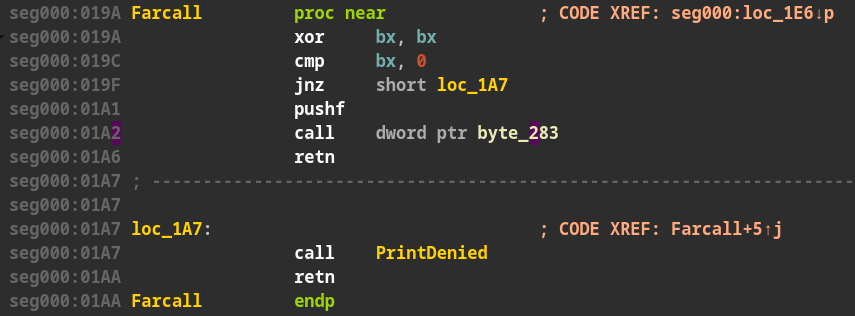
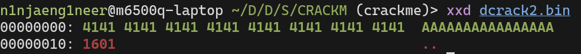
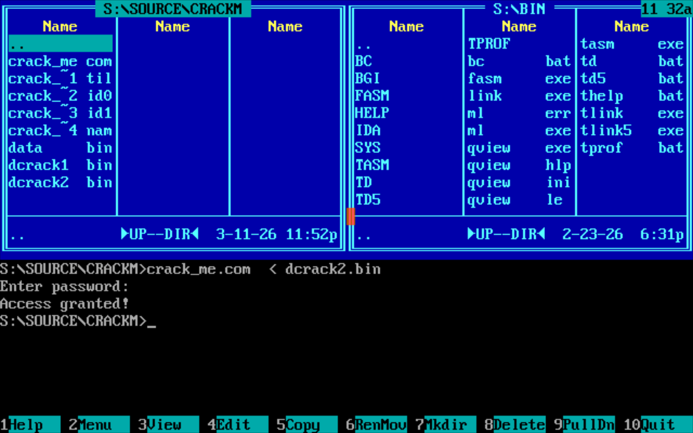
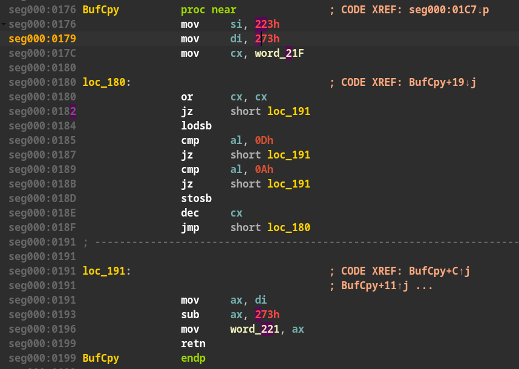
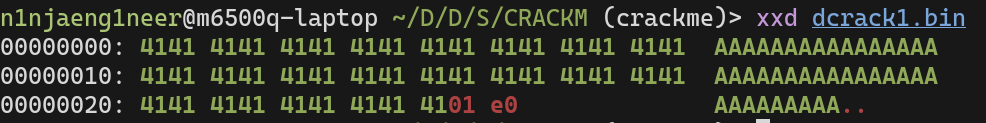
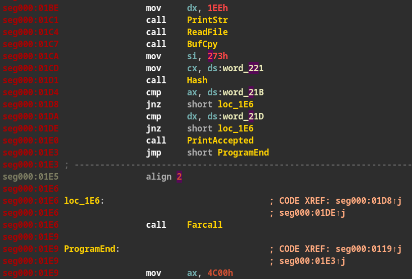

## Содержание

- [Введение](#введение)

- [Договоренности](#договоренности)

- [Описание программы](#описание-программы)

- [Уязвимость 1 (переполнение стека)](#уязвимость-1-переполнение-стека)

    - [Шаг 1. Поиск уязвимости](#шаг-1-поиск-уязвимости)

    - [Шаг 2. Взлом](#шаг-2-взлом)

    - [Результат](#результат)

- [Уязвимость 2 (подмена адреса jmp)](#уязвимость-2-подмена-адреса-jmp)

    - [Шаг 1. Восстановление адресов переменных](#шаг-1-восстановление-адресов-переменных)

    - [Шаг 2. Поиск уязвимости](#шаг-2-поиск-уязвимости)

    - [Шаг 3. Взлом](#шаг-3-взлом)

    - [Результат](#результат-1)

## Введение

В данном документе приведено описание выполнения задания из курса ассемблера ФРКТ МФТИ. Задание заключается в перекрестном взломе программы на языке ассемблера процессора Intel 80486 между двумя студентами (т.е. один студент взламывает программу другого и наоборот). В программу должно быть заложено 2 уязвимости, простая и посложнее.

Программы транслировались и запускались в эмуляторе MS-DOS (DOSBOX). Дизассемблирование проводилось в IDA (v9.3).

Ссылки на репозитории c исходным кодом: [ссылка 1](https://github.com/umarnurmatov/dosbox), [ссылка 2](https://github.com/matlire/TASM-learn).

## Договоренности

Адресам, соответствующим процедурам были присвоены текстовые метки для удобства. При упоминании процедур в данном документе в скобках указывается их адрес.  
Например: Readfile (seg:0150).

## Описание программы

При запуске программа просит ввести пароль. Пароль мы, естественно, не знаем. Надо ломать.  

## Уязвимость 1 (переполнение стека)

### Шаг 1. Поиск уязвимости

Внимательно изучая дизасм программы, обнаруживаем что чтение ввода пользователя происходит с помощью процедуры ReadFile (seg:0150).

Процедура ReadFile (seg:0150) читает из консоли (file handle = 0) максимум 80 (50h) байт, при этом размер стек-фрейма функции всего 40 (28h) байт. 

Следовательно, есть возможность перезаписать адрес возврата.

### Шаг 2. Взлом

Делаем бинарный файл размера 42 байта, где последние 2 байта — нужный нам адрес возврата (01e0h ---> call PrintAccepted) и перенаправляем в stdin программы (crack_me.com < dcrack.bin)

Результат взлома представлен на скриншоте ниже.

## Уязвимость 2 (подмена адреса jmp)

### Шаг 1. Восстановление адресов переменных

| Адрес | Метка | Значение | Вхождения |
| :---- | :---- | :---- | :---- |
| 21Bh |  | хэш (2 слова) | proc Hash (seg:0124) |
| 21Fh |  | кол-во считанных байт | proc ReadFile (seg:0150) |
| 221h |  | длина введенного пароля | proc ReadFile (seg:0150) |
| 223h | __buffer | буфер строки | proc ReadFile (seg:0150) proc BufCpy (seg:0176) proc Hash (seg:0124) |

### Шаг 2. Поиск уязвимости

Процедура BufCpy (seg:0076h) копирует из буфера __buffer в память по адресу 273h (__buffer + 50h) без проверки длины.  

Функция Farcall (seg:019A) делает jmp по значению из адреса 283h (273h + 16 байт).

Соответственно, в stdin можно передать программе файл с содержанием 16 байт + нужный адрес (0016: call PrintAccepted).

### Шаг 3. Взлом

Создаем бинарный файл, запускаем программу, перенаправляя содержимое файла в stdin программы.

Результат представлен на скриншоте ниже.

