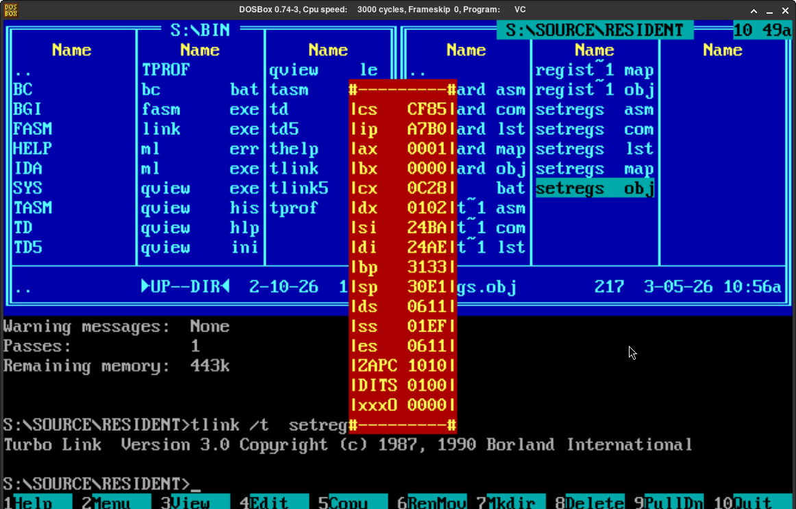

## Resident popup window (TSR)

### General description

This program is intended to fetch CPU register value in real-time mode in MS-DOS operating system and show them
inside a popup window. This program uses **Terminate and Stay Resident (TSR)** mechanism.



### Install & run

Make sure you have Turbo Assembler (`tasm`) and Turbo Linker (`tlink`) installed.

1. Clone this repository to your machine.
2. Compile & run:
```
cd RESIDENT
tasm REGIST.ASM
tlink /t REGIST.OBJ
REGIST.COM
```

### Usage
Press ```F5``` to make the window appear/disappear.
Flags are shown the following way:

| Field | Value                        |
|------|-------------------------------|
| ZAPC | Zero:Auxiliary:Parity:Carry   |
| DITS | Direction:Interrupt:Trap:Sign |
| xxx0 | Overflow                      |
